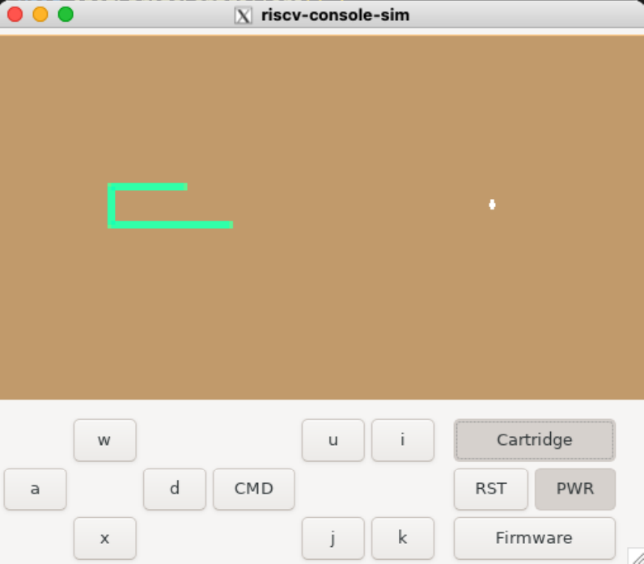
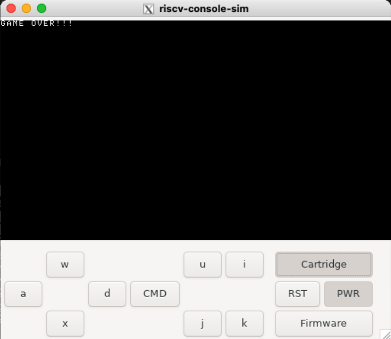

# Building a Game Console with RISC-V Architecture


## Table of Contents
- [About the Project](#about-the-project)
- [Getting Started](#getting-started)
  - [Project Overview](#project-overview)
  - [Prerequisites](#prerequisites)
- [Environment Setup](#environment-setup)
- [Playing the Snake Game](#playing-the-snake-game)
- [API Demonstration](#api-demonstration)
- [Author](#author)

## About the Project
This project showcases our ECS251 course project, featuring a playable Snake Game and a set of custom APIs developed by Team 2. Our work demonstrates our capability in software engineering, focusing on game development and API design.

<p align="center">
  
  
</p>

## Getting Started

### Project Overview

This project is a master-level lecture assignment aimed at deepening our understanding of system-level programming, API interaction, and the intricacies of software development close to the hardware. By utilizing RISC-V architecture to interact with system firmware and employing C—with pointers—and some assembly language, we have built a Snake Game that not only serves as an entertaining application but also as an educational tool to explore the following areas:

- **RISC-V Architecture**: Understanding how RISC-V operates and interacts with our game logic at a low level.
- **System Firmware Interaction**: Learning how software communicates with system firmware, and it is crucial for hardware-software integration.
- **C and Assembly Language**: Utilizing C for the game's logic and leveraging assembly language for performance-critical sections of the game, providing insights into efficient programming practices.
- **API Development and Usage**: Developing and using APIs to abstract the complexity of hardware interactions, making the game logic easier to implement and modify.

This project is designed to offer a hands-on experience in navigating and manipulating low-level systems, showcasing the power and versatility of combining C, assembly language, and RISC-V in software development.

### Prerequisites

Before you begin, ensure you meet the following prerequisites to fully engage with the project:

- **RISC-V Toolchain**: Installation of the RISC-V GNU Compiler Toolchain to compile and run RISC-V assembly and C code.
- **C Programming Knowledge**: A solid understanding of C programming, especially using pointers and managing memory manually, as this is crucial for interfacing with low-level system components.
- **Assembly Language Basics**: Familiarity with assembly language syntax and concepts, particularly for the RISC-V architecture, to understand and write performance-critical sections of the game.
- **Unix-like Environment or Terminal**: Access to a Unix-like environment (e.g., Linux, macOS, or a Unix-like terminal on Windows such as WSL) for running scripts and the simulation environment.
- **Development Tools**: Basic development tools such as `make`, `gcc` (for compiling any helper tools written in C), and a text editor or IDE suited for C and assembly development.

Optional but Recommended:
- **Emulator or Simulator for RISC-V**: Having a RISC-V emulator or simulator setup, such as QEMU for RISC-V or a specific RISC-V hardware simulator provided with the project, to test and debug your code in a controlled environment.
- **Version Control System**: Familiarity with using Git for version control to manage and document your development process.

These prerequisites are designed to equip you with the necessary tools and knowledge to successfully compile, run, and modify the Snake Game project while understanding the underlying system interactions and API usage.


## Environment Setup

1. **Console Script**:
   Run the console script to start the console.
```bash
./rvconsole.sh
```

2. **Simulation**:
Start the simulation with the following command.
```bash
./runsim.sh
```
3. **Firmware**:
Load the firmware by inserting the firmware strip file.

4. **Boot OS**:
Press `RUN/PWR` to boot the OS.

5. **Game Cartridge**:
Load the game cartridge by inserting the cartridge strip file.

## Playing the Snake Game

- **Control the Snake**: Use the up, down, left, or right buttons to control the snake.
- **Game Over**: Avoid borders and self-collision; otherwise, the game ends.
- **Pellets**: Eating a pellet increases the snake's length, appearing at random or fixed coordinates.
- **CMD Feature**: Use the CMD button to move the pellet, showcasing our custom API.
- **Game Over Screen**: Upon death, the game displays a "Game Over!!" message in text mode.

## API Demonstration

We've developed and utilized 23 APIs for this project, with key highlights including:

- **Game Mechanics**: APIs like `getTicks`, `genRandom`, and `getStatus` for dynamic gameplay.
- **Graphics and Text Modes**: Switching between modes with `setGraphicsMode` and `setTextMode`.
- **Multithreading**: Demonstrated with `InitContext` and `SwitchContext`.
- **Sprite Management**: APIs such as `setColor`, `setBackgroundColor`, and sprite control functions enhance visual elements.

These APIs exemplify our technical prowess in creating engaging and interactive game features.

## Author

Timothy Hwang
